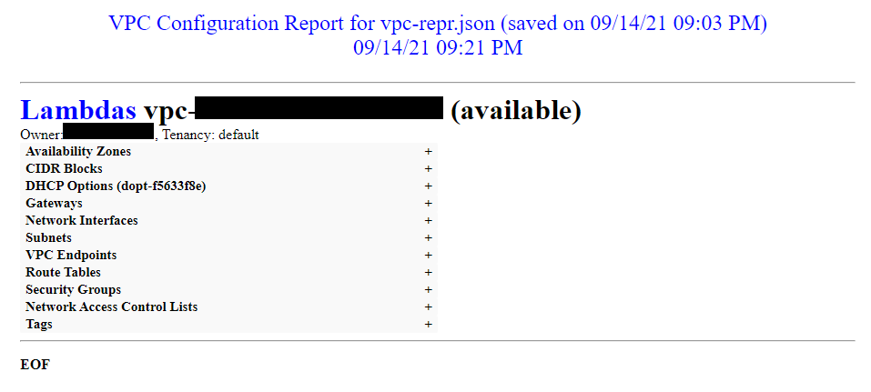

# VPC Reporter (vpc-repr)

A report generation utility aimed at networking and security aspects of AWS VPCs in a given Region.

## Purpose

This was written with the hope of alleviating the nuisance that can be experienced with issue resolution within a VPC, having to navigate across myriad browsers windows and trying to remember cryptic IDs. The intention was to see if having all the information on one browser page, picking and choosing which features to look at, would be any easier. I'm still not sure if it will help but I think I succeeded in putting a pretty extensive version 1 together in order to do the evaluation. You can decide for yourself. The output HTML file may also prove to be a useful tool for reviewing architecture in a group setting.

The software does not focus at all on EC2 instances.  While all of the code uses the Boto3 EC2 client using describe-xxx methods, the focus is on configuration items such as Route Tables and Security Groups. Here is a quick image of a collapsed page with a little redaction:



## Version 2 Features

With version 2, I've added some features that terminal users might be interested in as well as impacts to the HTML output. I decided to make this version 2 simply because the command line arguments have been changed enough to the point were the new version is not completely backward compatible. In simple terms, the following features have been added:

- Uses the Python "argparse" argument parsing library for command line options.
- The ability to specify an AWSCLI profile to use instead of defaulting.
- Writing JSON to a file, allowing it to be read back into the application for subsequent viewing to avoid having to run commands against AWS.
  - of course jq can always be used on the JSON output as a more robust search and filtering tool.
- Section switches, limiting what appears in stdout (both JSON and HTML).
- IP Search function to find IP Address or Networks that match/overlap. See "Verbose" help below.

## Version 1 Features / Notes

- Collapsible sections to allow focusing on the sections you are interested in.
- Keyword occurrences such as IDs can be highlighted using browser find feature (on non-collapsed sections).
- Excludes default VPC.
- Some list items are sorted for easier readability and referencing.
- Session profile defaults to environment settings.
- Region defaults but can be overridden.
- All VPCs in the Region will be reported by default.
- Ability to limit VPC output by listing the VPC IDs on the command line.
- HTML is sent to stdout (redirect it to a file of your choosing).

## Python Script

* __<span>[vpc-repr.py]()</span>__ - the lone reporting script.

## Usage

```bash

usage: vpc-repr.py [-h] [-filename FILENAME] [-profile PROFILE] [-region REGION] [-vpc-ids vpc-id [vpc-id ...]] [-j [filename]]                    [-w] [-ip IP] [-verbose] [-az] [-ci] [-do] [-ep] [-gw] [-na] [-ni] [-pc] [-rt] [-ta] [-sh] [-sn] [-sg] [-vp]

VPC Report Generator

optional arguments:
  -h, --help            show this help message and exit
  -filename FILENAME, -f FILENAME
                        Input JSON filename (override read from AWS)
  -profile PROFILE      AWSCLI profile to use (override environment settings)
  -region REGION        AWS Region to report on (override environment settings)
  -vpc-ids vpc-id [vpc-id ...]
                        When specified, limits to one or more VPC IDs versus all VPCs in the Region
  -j [filename], -json [filename]
                        Output JSON to stdout (unless -w specified), optionally specify filename to override vpc-repr.json
  -w, -web              Output HTML to stdout
  -ip IP                IP Search - enter IP Address or Network with prefix (e.g. 10.10.10.10 or 10.10.10.0/24)
  -verbose              Display additonal help on -ip switch and command line examples
  -az                   Show Availability Zones
  -ci                   Show CIDR Blocks
  -do                   Show DHCP Options
  -ep                   Show Endpoints
  -gw                   Show Gateways
  -na                   Show NACLs
  -ni                   Show Network Interfaces
  -pc                   Show Peering Connections
  -rt                   Show Route Tables
  -ta                   Show VPC Tags
  -sh                   Show Sharing - reserved for future use
  -sn                   Show Subnets
  -sg                   Show Security Groups
  -vp                   Show VPNs - reserved for future use

Read Mode:
    . ON when -f filename is specified
    . json is read from filename (not AWS)
    . no interaction with AWS
    . does not save an output json file (ignores any -j output file names)
    . only writes to stdout based on -j or -w switches

Standard Mode:
    . data is collected from AWS:
        . using profile from environment, default or from -profile if specified
        . using region from profile or from -region if specified
        . for all VPCs in region (except default VPC) or only those specified with -vpc-ids
    . complete json from AWS (except ResponseMetadata) is always written to a file
        . describe_vpcs() is used to load the vpc objects into memory
        . each vpc object is augmented with other objects (e.g. "AvailabilityZones":...) using other describe methods
          to build a larger vpc object
        . output is written to 'vpc-repr.json' unless a filename is specified after -j switch
        . output json is slightly augmented in some cases with a 'Notes' attribute with comments or 'name' data
          taken from a separate AWS method

All Modes:
    . -j or -w dictates output format to stdout (-w is assumed if no switch is specified)
        . if -j and -w are not specified, json is written to vpc-repr.json and html is written to stdout
        . if -j and -w are both specified, json is written to filename, if specified, and html is written to stdout
        . if -j alone is specified, json is written to vpc-repr.json or filename specifed, and is written to stdout
    . section switches (e.g. -az, -ci, -do) control stdout output sections only
        . no switches causes ALL sections to be output to stdout
        . one switch will cause the VPC shell and that section only to be output to stdout
        . certain referenced data from other sections may be omitted when that section is not included
          (e.g. subnet names if -sn section is omitted)
    . to capture section switch limited json to a file, use -j switch and redirect stdout to a file
    . use -ip search switch to look for ip address and network overlaps
    . use -verbose switch for more info on -ip switch and command line examples
    
```

## Verbose Help

```bash

IP Search Switch:
    . read data from AWS or json file
    . processes all other command line options
    . -ip address or -ip network can be used (e.g. 10.10.10.10 or 10.10.10.0/24)
    . ipv4 and ipv6 are supported; these json keys are inspected:
        . ipv4: CidrBlock, Cidrs, PrivateIp, PrivateIpAddress, PublicIp, CustomerOwnedIp,
                TransitGatewayCidrBlocks, CarrierIp, DestinationCidrBlock, CidrIp, CidrIpv4
        . ipv6: Ipv6CidrBlock, DestinationIpv6CidrBlock, Ipv6Address, CidrIpv6
    . uses ipaddress.network.overlap() function; any overlap will be reported
        . argument is part of network cidr found (its an ip or subnet of found cidr)
        . argument cidr contains ip or cidr found (its the network or supernet of found ip or cidr)
        . argument ip directly matches found ip
        . will NOT match 2 IPs that might be in the same network (no way of knowing)
    . when a match is found, a yellow 'Match Found' will be written next to the match on screen
    . may find customer owned ip but generally will not find customer owned ip pools

Examples:
    vpc-repr.py
        . profile and region will default to environment
        . all VPCs in the region will be reported (except for the default VPC)
        . all content sections will be included in stdout
        . complete json will be written to vpc-repr.json
        . html will be output to stdout

    vpc-repr.py -profile prod -region us-east-1 -j
        . profile and region are overridden and Boto3 will look for profile in config file for credentials
        . all VPCs in the us-east-1 region will be reported (except for the default VPC)
        . all content sections will be included in stdout
        . complete json will be written to vpc-repr.json
        . json will be output to stdout

    vpc-repr.py -vpc-ids vpc-1 vpc-2 vpc-3 -j vpc123.json -ci -na -sg -sn -rt
        . profile and region will default to environment
        . 3 VPCs will be reported on: vpc-1, vpc-2 and vpc-3
        . the VPC shell, CIDRs, NACLs, Security Groups, Subnets and Route Tables will be output to stdout
        . complete json will be written to vpc123.json
        . json will be output to stdout

    vpc-repr.py -f vpc123.json -vpc-ids vpc-2 -gw -rt -w
        . vpc123.json will be read in instead of using AWS
        . 1 VPC will be reported on: vpc-2
        . the VPC shell, Gateways and Route Tables will be output to stdout
        . nothing will be written to vpc-repr.json
        . html will be output to stdout

    vpc-repr.py -f vpc123.json -vpc-ids vpc-2 -ip 10.10.10.0
        . vpc123.json will be read in instead of using AWS
        . 1 VPC will be reported on: vpc-2
        . all content sections will be included in stdout
        . nothing will be written to vpc-repr.json
        . html will be output to stdout
        . ip 10.10.10.0 will be changed to 10.10.10.0/32
        . 10.10.10.0/32 will be used to find IPv4 network overlaps
        . overlapping addresses in stdout will be highlighted with 'Match Found!'

    vpc-repr.py -f vpc123.json -vpc-ids vpc-2 -ip 10.10.10.0/24 -j
        . vpc123.json will be read in instead of using AWS
        . 1 VPC will be reported on: vpc-2
        . all content sections will be included in stdout
        . nothing will be written to vpc-repr.json
        . json will be output to stdout
        . 10.10.10.0/24 will be used to find IPv4 network overlaps
        . overlapping addresses in stdout will be highlighted with 'Match Found!'

```

## Requirements

Python 3.6 or later, latest Boto3 and the latest AWS CLI unless you wish to manually configure the environment, see [https://boto3.amazonaws.com/v1/documentation/api/latest/guide/quickstart.html](https://boto3.amazonaws.com/v1/documentation/api/latest/guide/quickstart.html).

The software has been tested and works on Windows 10 and Ubuntu 18.04.

## To Do

- VPN details
- VPC Sharing details
