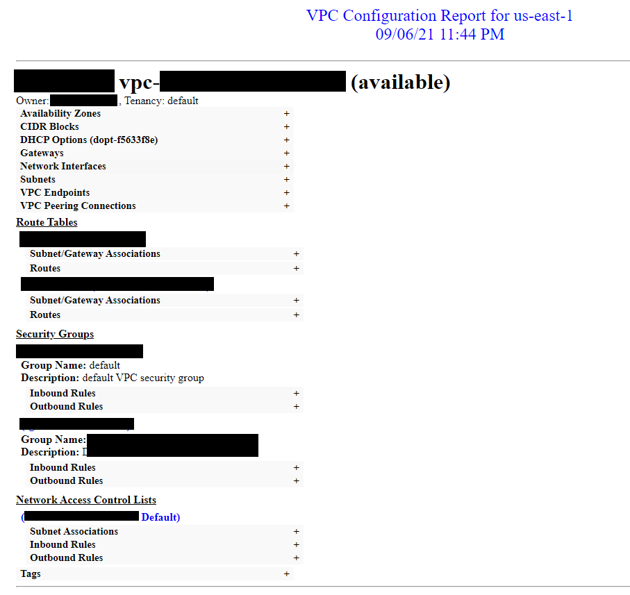

# VPC Reporter (vpc-repr)

A report generation utility aimed at networking and security aspects of AWS VPCs in a given Region.

## Purpose

This was written with the hope of alleviating the nuisance that can be experienced with issue resolution within a VPC, having to navigate across myriad browsers windows and trying to remember cryptic IDs. The intention was to see if having all the information on one browser page, picking and choosing which features to look at, would be any easier. I'm still not sure if it will help but I think I succeeded in putting a pretty extensive version 1 together in order to do the evaluation. You can decide for yourself. The output HTML file may also prove to be a useful tool for reviewing architecture in a group setting.

The software does not focus at all on EC2 instances.  While all of the code uses the Boto3 EC2 client using describe-xxx methods, the focus is on configuration items such as Route Tables and Security Groups. Here is a quick image of a collapsed page with a little redaction:



## Python Script

* __<span>vpc-repr.py</span>__ - the lone reporting script

## Usage

```bash
python vpc-repr.py [region [vpc-id...]] >report.html
```

- session profile defaults to environment settings

- region defaults but can be overridden, e.g.: 

  `python vpc-repr.py us-east-1 >report.html`

- all VPCs in the Region will be reported by default

- specify Region and one or more VPC IDs to limit the output, e.g.:

  `python vpc-repr.py us-east-1 vpc-xxxx vpc-yyyy >report.html`

- all output goes to stdout so redirect it into an html file of your choosing

## Features / Notes

1. Collapsible sections to allow focusing on the sections you are interested in
2. Keyword occurrences such as IDs can be highlighted using browser find feature (on non-collapsed sections)
3. Excludes default VPC
4. Some list items are sorted for easier readability and referencing

## Requirements

Python 3.6 or later, latest Boto3 and the latest AWS CLI unless you wish to manually configure the environment, see [https://boto3.amazonaws.com/v1/documentation/api/latest/guide/quickstart.html](https://boto3.amazonaws.com/v1/documentation/api/latest/guide/quickstart.html).

The software has been tested and works on Windows 10 and Ubuntu 18.04.

## To Do

- VPN details
- Figure out how to do nested accordions for Security Groups, Route Tables and NACLs (but I have no js skills)
